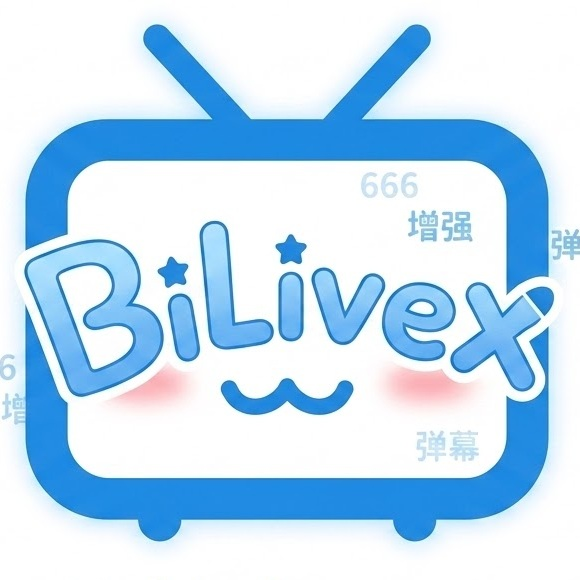
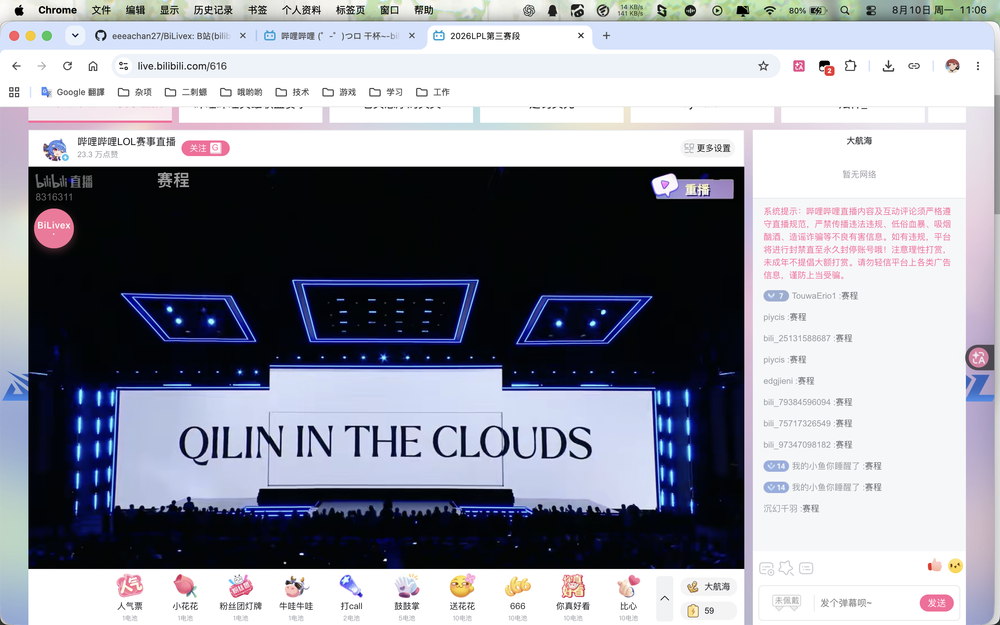
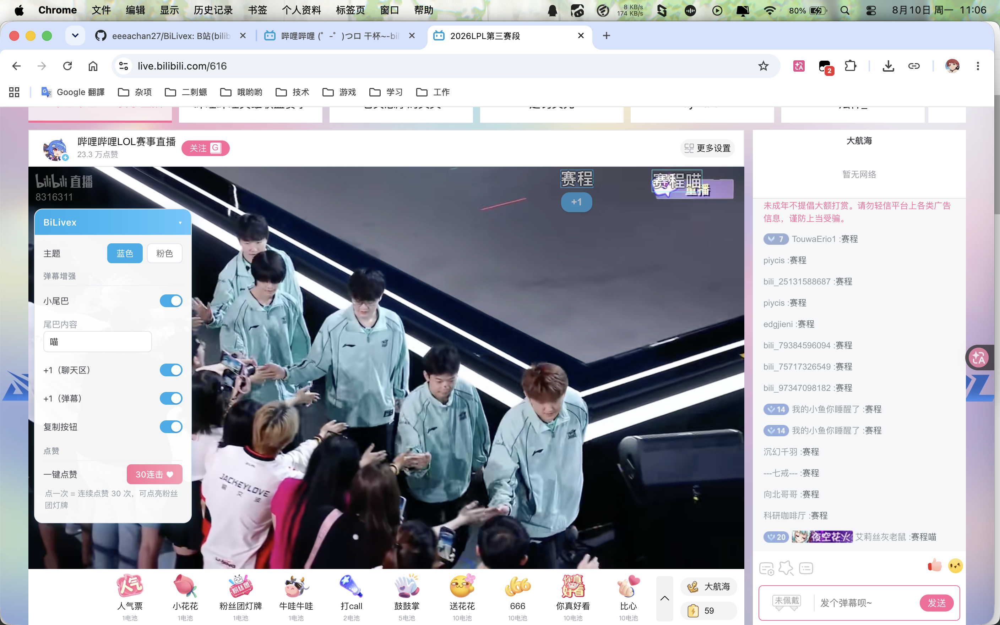

# BiLivex 🎮

**哔哩哔哩直播间增强插件（油猴 Tampermonkey）**

参考斗鱼 DouyuEx 插件开发，为 B 站直播间（live.bilibili.com）弹幕功能量身打造的增强脚本。

---

## 📢 引言

各位玩小将，是否因为在 B 站看直播无法 **+1** 而手痒难耐？🖐️

管人痴，是否因为想在直播间臊皮、跟上弹幕节奏，却还要麻烦地复制粘贴？😩

那么，试试 **BiLivex** —— 弹幕一键 +1，带节奏从此告别复制粘贴！

## ✨ 核心功能

| 功能             | 说明                                                               |
| -------------- | ---------------------------------------------------------------- |
| **弹幕 +1**      | 鼠标悬停弹幕 → 弹幕高亮（插件设计的主题色）+ 下侧浮现「+1」按钮 → 点击后自动填入并发送同内容弹幕            |
| **弹幕复制**       | 光标放置在右侧评论区时出现「复制」按钮，一键复制弹幕文本                                     |
| **弹幕小尾巴**      | 发送弹幕（+1 或自行输入）时自动在末尾附加预设文本（如「你好」→「你好喵」）；独立小窗口可开关 + 编辑文本          |
| **一键点赞 30 连击** | 一键连续点赞 30 次，点亮 B 站粉丝团灯牌                                          |
| **主题切换**       | 面板顶部一键切换「B 站蓝」/「B 站粉」主题，配色联动全局（标题 / 开关 / 按钮 / 弹幕高亮 / 反馈动画），设置持久化 |
| **侧边悬浮主菜单**    | 蓝 / 粉主题悬浮面板，置于直播间右侧，可折叠、可拖拽，所有设置自动保存                             |

## 📸 效果预览

| 未开启面板                                                                                          | 开启面板（蓝色主题）                                                                                     |
| ---------------------------------------------------------------------------------------------- | ---------------------------------------------------------------------------------------------- |
|  |  |

## 📥 安装

### 方式一：Greasy Fork（推荐）

- 直达链接：https://greasyfork.org/zh-CN/scripts/590601
- 或直接在 Greasy Fork 搜索「BiLivex」安装

### 方式二：手动安装

1. 浏览器安装 Tampermonkey（油猴）扩展
2. 打开油猴管理面板 → 新建脚本 → 删除模板内容 → 粘贴 `bilive-enhance.user.js` 全部内容 → 保存
   （或直接双击 `.user.js` 文件，油猴会弹出安装页）
3. 打开任意 B 站直播间（live.bilibili.com/房间号），右侧出现 BiLivex 面板即生效

## 🎯 使用说明

- **评论区+1 / 复制**：鼠标放置到聊天区某条弹幕上，弹幕右侧浮现操作按钮
- **弹幕+1**：直播画面上飘过的弹幕，鼠标悬停即可冻结弹幕并 +1
- **小尾巴设置**：面板中「小尾巴」开关 + 「尾巴内容」输入框（默认「喵」）
- **自己的弹幕**：自己发出的弹幕在聊天区带蓝色边框，方便在滚动消息中找到
- **主题设置**：面板顶部切换蓝色 / 粉色主题，偏好自动保存
- **持久化**：所有设置自动保存（GM_setValue / GM_getValue），刷新 / 换房不丢失

## 🗺️ 开发计划

- [ ] **收藏弹幕**：创建或快捷收藏自己喜欢的「烂梗」，一键复用
- [ ] **独轮车功能**：酌情开发，若违反社区条例则废除该计划 🚧

> 欢迎提交 Issue / PR，一起让 BiLivex 更好用！

## 📜 版本历史

<b>v1.0.11</b>（2026-08-29）：自己发送的弹幕用蓝色边框标出；修复分栏聊天区小尾巴不生效的问题

<b>旧版本</b>：v1.0.10 及更早版本

- **v1.0.10**（2026-08-15）：修复 iframe 直播间弹幕悬停判定区域偏移、弹幕与 +1 按钮间隙、全屏 +1 无法发送、边缘弹幕悬停文字超出画面等问题

- **v1.0.9**（2026-08-14）：修复长时间悬停弹幕文字消失、悬停弹幕动画恢复、小尾巴重复发送、顶部/底部特殊弹幕命中等问题

- **v1.0.8**（2026-08-13）：修复活动直播间悬浮球拖动弹跳、无法自由定位，以及展开菜单被强制吸附的问题

- **v1.0.7**（2026-08-12）：修复悬浮球右侧收起偏移、漂浮弹幕轻微抖动、弹幕悬停后超出直播画面、左上角闪现已结束弹幕、悬停弹幕与 +1 按钮间空隙导致取消悬停、部分场景 +1 按钮不显示等问题
- **v1.0.6**（2026-08-11）：修复开启插件后直播间漂浮弹幕数量明显变少的问题（评论区能看到消息但画面中弹幕大量缺失），弹幕显示恢复正常；保留悬停残留弹幕自动清理
- **v1.0.5**（2026-08-11）：修复鼠标在画面左上角滑移导致弹幕卡死（已滚出画面/即将结束的弹幕不再冻结，快速滑移自动释放）
- **v1.0.4**（2026-08-11）：修复鼠标在画面左上角滑移导致历史弹幕卡死（自动清理生命周期已结束的弹幕）、悬浮球吸附右侧时展开菜单方向错乱
- **v1.0.3**（2026-08-11）：折叠态悬浮球升级为圆形 logo；修复特殊直播间菜单被遮蔽、悬浮球拖动受限、菜单展开方向错乱、菜单超出网页边界等问题；展开菜单支持边缘吸附
- **v1.0.2**（2026-08-10）：发布版整理
- **v1.0.1**（2026-08-07）：修复面板重建时 document 级监听器累积泄漏、弹幕按钮重建时旧监听器未清理

## 🙏 致谢

- 灵感来源及代码设计参考自 **DouyuEx 作者小淳**：[Bilibili 空间](https://space.bilibili.com/193482)，感谢淳圣开源 💙
- 本项目约 80% 内容由 **vibe coding** 产出，欢迎使用、Star与转发！

---

⭐ 如果这个插件帮到了你，欢迎 Star 支持一下！

